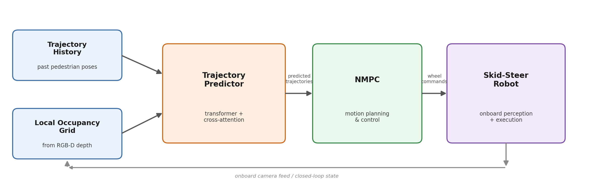
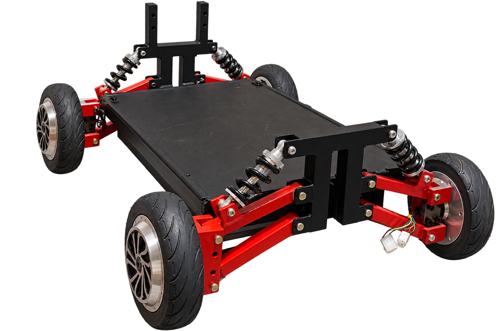

# Scene-Context-Aware Pedestrian Trajectory Prediction for NMPC-Controlled Skid-Steer Navigation

A transformer-based pedestrian trajectory predictor, conditioned on local scene occupancy, integrated with NMPC and deployed on a physical skid-steer robot.

